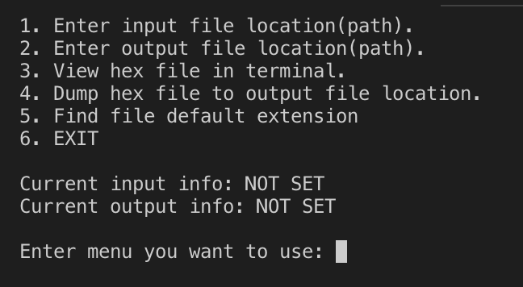

# Project Hex View - SecurityFACT By Jason Kang

## Source:
----
https://github.com/KangDroid/HexView

## Features:
1. View input file as hex view.
2. Dump hex file to plain text
3. Enabling input/output FILE location customization
4. Find file extension based on "file path & name"

## Screenshots(Main Menu):
----

## TODO
----
1. File extension Improvements: Using File signature & file structure
2. Print each address when viewing the file.